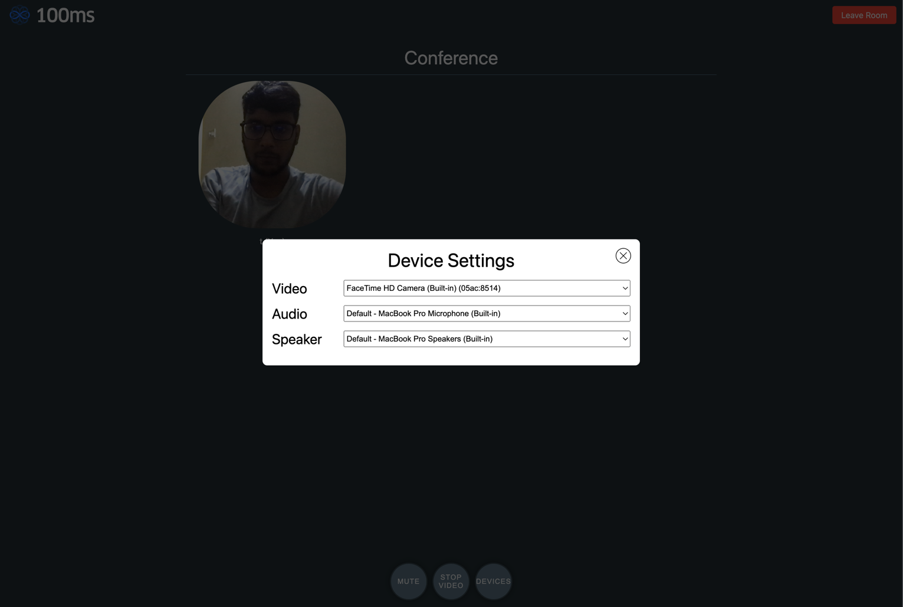
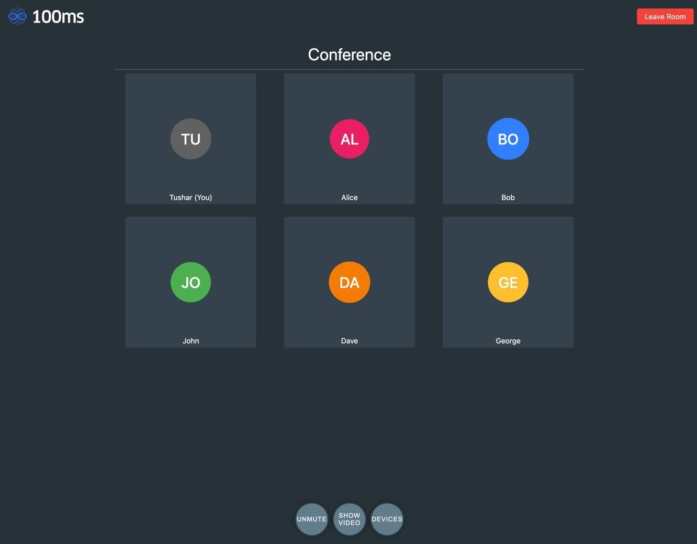
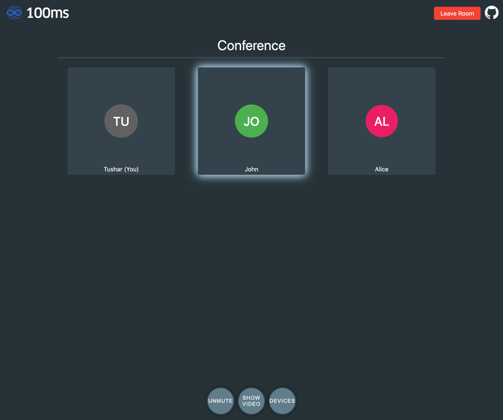
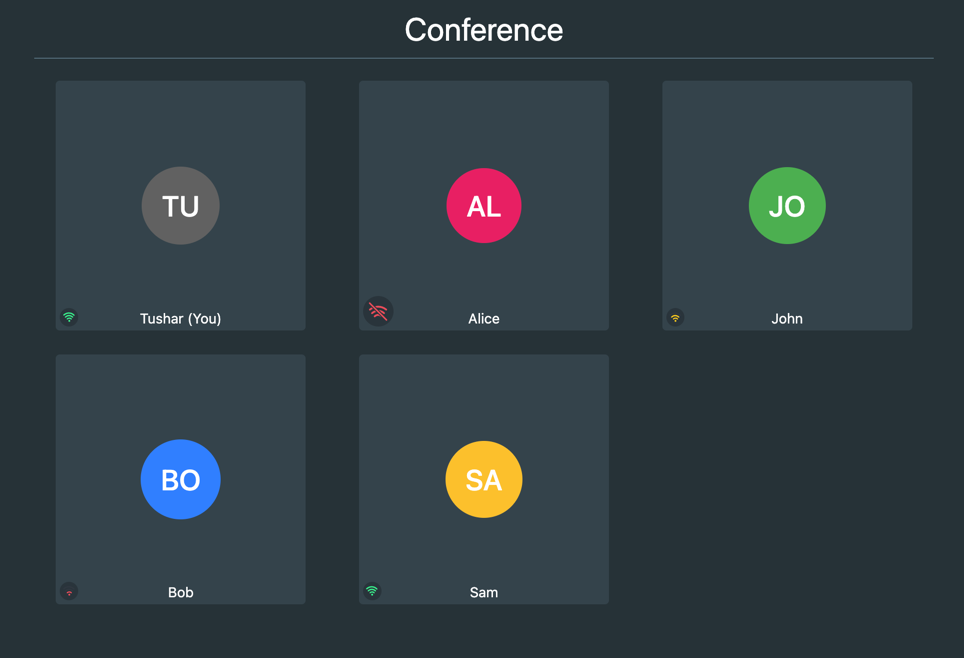
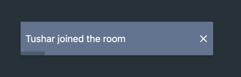
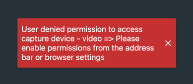
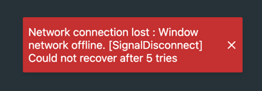
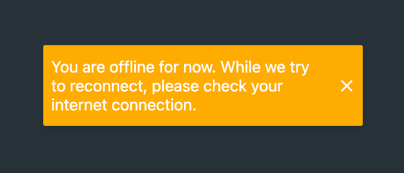
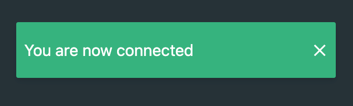

This branch builds upon the [main](https://github.com/100mslive/svelte-100ms) branch where we go through steps to set up a simple Video Call App in Svelte. Now that we have built the app, we'll go through adding different important features in the app.

## Deploy

Use the above button to create a clone of this branch in your GitHub and deploy on Vercel. You can then commit any changes in your personal repo and see them reflected in the deployment. 

## Demo 

[Demo Link](https://svelte-100ms.vercel.app/)

Steps at - https://github.com/100mslive/svelte-100ms#demo

Feel free to reach out to us over [Discord](https://100ms.live/discord).

# Features

These are present in the order they were added in the repo to follow through easily. Note that sometimes minor bugs in a feature are fixed in subsequent commits, so in case you're picking up from any single component, do check out the latest state of the corresponding file in the branch.

## Device Settings([Commit1](https://github.com/100mslive/svelte-100ms/commit/936ff04f6a4631b981f802211bf53ff314695c44), [Commit2](https://github.com/100mslive/svelte-100ms/commit/183b24b820c70f3987c28581104ed516b3ca7fcc))

Giving user the ability to change between audio and video devices is a must for any Video Call Application. The relevant SDK's selectors and methods are documented [here](https://www.100ms.live/docs/javascript/v2/features/device-change).

Changes done - 
- Create two new svelte stores in hmsStore.ts - `hmsAllDevices` for list of all devices and `hmsSelectedDevices` for the selected devices
- Install svelte-simple-modal as dev dependency(`yarn add svelte-simple-modal --dev`) for rendering device selection in a modal
- Create a [`DeviceSettings.svelte`](./src/routes/DeviceSettings.svelte) component which is responsible for showing the devices in select dropdowns and handle change
- Create a new button in Footer which can be clicked to open the Device Settings modal
- Add some css to Device Settings to make it look consistent

## Avatar when video is muted or degraded([Commit1](https://github.com/100mslive/svelte-100ms/commit/f799bbb86f763297cf0ac424566f0289b1f8237a), [Commit2](https://github.com/100mslive/svelte-100ms/commit/b9dc19904be80530b1fec95995c990a68dcea17d))

Right now when the video is muted, we're showing blank page, let's change this to show a nice looking Avatar based on name.

> Note that we'll also show this avatar when the video is [degraded](https://www.100ms.live/docs/javascript/v2/features/sub-degradation) as the video would appear to freeze otherwise. The 100ms SDK degrades a remote track when the local bandwidth is not enough to download the video.

Changes done -
- Create a `_components` folder in routes, to store components. The folder is prefixed with `_` so it's not counted in routes.
- Create an [`Avatar.svelte`](./src/routes/_components/Avatar.svelte) component. It takes name as an input, picks a color based on first letter and shows the initials of the name over the chosen color.
- Remove margin from the Video component and make it take full width/height of parent. This is to give the control to Peer component.
- Get the video track using hmsStore in a local variable. Put a condition to show Avatar when the video is disabled or degraded. Add fancy css to make it all look good, all thanks to flex and `position:absolute`.

> An important point to note here is that Video component should always be part of the dom. That is a code like this - `if (condition) {Avatar} else {Video}` is not correct(though it will work). Avatar needs to be present as an overlay on top of the Video component, than there being a conditional render between Avatar and Video. This is to avoid video element being frequently recreated as well as for the sdk to be aware of the UI's intention to show video in case of degradation.

## Audio Level([Commit](https://github.com/100mslive/svelte-100ms/commit/d669a10532a5c13d27a4b6160494337067ab1819))

It's helpful to show the audio level in a video call to know who is speaking at the moment. Let's implement this following the docs [here](https://www.100ms.live/docs/javascript/v2/advanced-features/audio-level). The way we'll show it is by creating a box-shadow around the video element of the peer who is speaking.

Changes done - 
- Add logic in `Video.svelte` to monitor audio level for the peer and add border appropriately.

## Join Improvement - Remember name and token, also take from query param([Commit](https://github.com/100mslive/svelte-100ms/commit/15010972fbd07e126fccbf33232fc0a3d8555780))

- Remember name and token by saving them to local storage so the user doesn't have to enter them every time.
- Add two query params, name and token so a shareable link can be made with token already embedded in. An url can be made in this form now - `baseUrl?token=<auth_token>`, to have the token prefilled.
- Change the button text from "Join" to "Joining..." when join is in progress.

## Add Share/Copy link button([Commit](https://github.com/100mslive/svelte-100ms/commit/1accff7dda439b2fc3e810c017f83c522baa7889))

The purpose of share link button is to get a sharable link(copied to clipboard) which can be sent to others for joining the same call.

- Install feather icons - `yarn add --dev svelte-feather-icons`
- Create a writable tokenStore to hold the auth token which will be used to create the sharable url. This is created in `hmsStores.ts`.
- Create a new [`ShareLink`](./src/routes/_components/ShareLink.svelte) component to copy the url and put it in Header component

## Use Icons in Footer([Commit](https://github.com/100mslive/svelte-100ms/commit/e9b165accc58b04d3a1ef4397a82dc9ac3445a1c))

- Use Feather icons for audio, video and device settings

## Network Quality([Commit](https://github.com/100mslive/svelte-100ms/commit/6796c79e61d7fe14c4689790337c00b69cb61209))

Ever had those "I wonder whose internet is bad" moment in a Video call. The SDK gives the connection score of everyone in the room for times like these, as documented [here](https://www.100ms.live/docs/javascript/v2/advanced-features/connection-quality). Let's build it out in the UI.

- Create a new [`ConnectionQuality.svelte`](./src/routes/_components/ConnectionQuality.svelte) component which takes in a peer id and renders the network quality score for the peer in form of Wi-Fi signal. It does by using SVG images, there is one svg image for when connection score is 0(disconnected), and a set of arcs resembling the Wi-Fi signal colored per the score for connection score > 0. 
- Add the new component in `Peer.svelte` to show on the tile on bottom left.

> To know more about what different connection scores represent check out the [docs](https://www.100ms.live/docs/javascript/v2/advanced-features/connection-quality#score-interpretation)

## Notifications([Commit](https://github.com/100mslive/svelte-100ms/commit/6deb8ef704e61ec52870da1a9122dbdbe1c2f456))

Notifications can be used to show toast messages for events happening in the room, like a peer joining, receiving a message, device change, errors, reconnections, disconnections etc.

Examples - 

- Install a toast library - `yarn add @zerodevx/svelte-toast --dev`
- Write a wrapper over the toast library in [`toasts.ts`](./src/routes/_components/toasts.ts), styles added globally in `styles.css`
- Create a new component - `Notifications.svelte` responsible for displaying toasts, rendering the SvelteToast component
- Render Notifications component first thing in the page component
- Listen to the notifications from SDK using `hmsNotifications` and show appropriate toasts per the documentation [here](https://www.100ms.live/docs/javascript/v2/features/notifications) and [here](https://www.100ms.live/docs/javascript/v2/features/error-handling).
- For reconnection notification, we'll also build a special type of toast which can be updated in place. So the reconnecting notification itself is changed to connected once reconnection is successful.
- Also remove any existing toasts whenever join button is clicked in `JoinForm.svelte`.

> The device permissions error is the most common errors seen in production use. It can be very useful to tell user more about giving device permissions in case of such errors.

## Autoplay Error

Most browsers have a restriction on audio autoplay where audio is allowed only if the user has interacted with the page. This is very important error to handle as when this happens you user won't be able to hear others in the room. [Docs](https://www.100ms.live/docs/javascript/v2/features/error-handling#handling-autoplay-error).

- Create an [`AutoPlayError.svelte`](./src/routes/_components/AutoPlayError.svelte) component responsible for letting the user know about the issue and giving an actionable button to resume audio which will call the SDK function.
- Add an else if block in the Notifications component for autoplay error(code = 3008) and open the AutoPlayError component in a modal when it happens.

