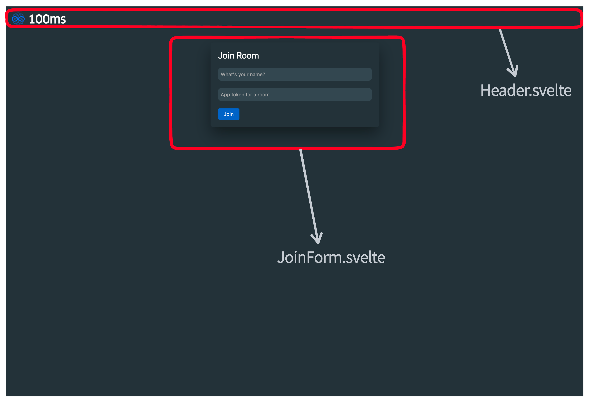
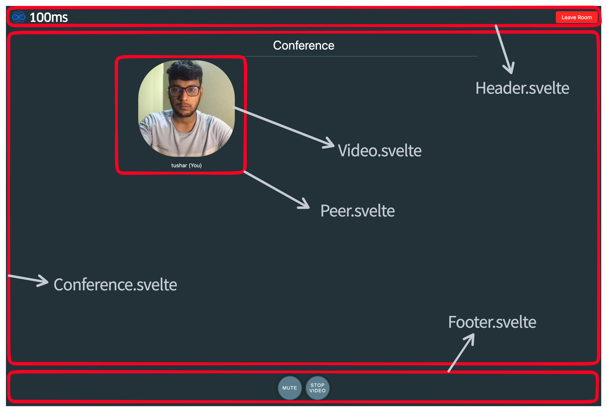

A Video Call app built with SvelteKit, using 100ms' SDK for the conferencing part.

Adapting [React Quickstart](https://www.100ms.live/docs/javascript/v2/guides/react-quickstart) for Svelte. And then building a ton of features on top - checkout the [features branch](https://github.com/100mslive/svelte-100ms/tree/features) for these.

Feel free to reach out to us over [Discord](https://100ms.live/discord) for any queries.

## Deploy

[](https://vercel.com/new/clone?repository-url=https%3A%2F%2Fgithub.com%2F100mslive%2Fsvelte-100ms&project-name=svelte-100ms-video-call&repo-name=svelte-100ms-video-call&demo-title=Svelte%20%2B%20100ms&demo-description=A%20video%20call%20app%20built%20with%20SvelteKit%20and%20100ms&demo-url=https%3A%2F%2Fsvelte-100ms.vercel.app%2F&demo-image=https%3A%2F%2Fraw.githubusercontent.com%2F100mslive%2Fsvelte-100ms%2Fmain%2Fstatic%2Fconference.png)

Use the above button to create a clone of this app in your GitHub and deploy on Vercel. You can then commit any changes in your personal repo and see them reflected in the deployment. 


[](https://codesandbox.io/s/github/100mslive/svelte-100ms?file=/src/routes/%2Bpage.svelte)

You can also try out the code with live demo on CodeSandbox by going to the above link. If CodeSandbox shows an error, reload its demo url.

## Demo

To try out the demo link you can follow these steps - 
1. Create an account on https://dashboard.100ms.live/
2. Get an auth token for a room following [this](https://www.100ms.live/docs/javascript/v2/guides/token#getting-a-temporary-token).
3. Go to the [Demo link](https://svelte-100ms-main.vercel.app/) and enter name and auth token. You can send over the link to someone else or
  open in another tab to test the call.
  
> Note: There are two demo links - 
> - https://svelte-100ms-main.vercel.app - for this branch(main) - basic Video Call, join, mute/unmute and see others in the room
> - https://svelte-100ms.vercel.app - for the [features branch](https://github.com/100mslive/svelte-100ms/tree/features), more details in the branch's README

## Component structure in the repo

The top level component is src/page.ts, there are two views, if the user is loading the page, they're shown a join form page. If they're connected to the room they're shown the conference page which shows their and remote peers' videos.




## Steps to build from scratch - (with commits linked for the step)

1. [Commit](https://github.com/100mslive/svelte-100ms/commit/e8d29ab266b3d9a1b92a55bcf0d2c259dc206c51) - Svelte kit create, git init
   ```sh
   > npm create svelte@latest svelte-hms-world
   > cd svelte-hms-world
   > yarn install
   > yarn dev --open
   > git init && git add -A && git commit -m "Initial commit"
   ```

2. [Commit](https://github.com/100mslive/svelte-100ms/commit/da65da4875b279ab10cc43f2cc18a2aff0471388) -Delete everything inside the routes folder(apart from styles.css) - let's start clean.
3. [Commit](https://github.com/100mslive/svelte-100ms/commit/11f3359672ad89f6e0fdd0e8205d66a9847e53d7) -Svelte dev would stop here due to error. Create a +page.svelte file in routes with head and importing styles.
4. [Commit](https://github.com/100mslive/svelte-100ms/commit/37ed4c2d5cee13166d9aae433e05fc10031c5794) - `yarn add @100mslive/hms-video-store` and then create a hms.ts file as described [here](https://www.100ms.live/docs/javascript/v2/features/integration#java-script).
5. [Commit](https://github.com/100mslive/svelte-100ms/commit/1c73da6d6c35b3f8d72e7af431c352271f44c0a7) - Create structure for the UI components -
   - page.svelte - already there, this will render Header, Footer and either of JoinForm or Conference depending on whether the user is connected to the room. 
   - JoinForm.svelte - we'll create a form to take in the username and the auth token here. Rendered when not connected to room.
   - Conference.svelte - top level component when connected to room. 
   - Header.svelte - normal header with a leave button
   - Footer.svelte - footer with audio video toggle buttons
   - Video.svelte - responsible for rendering a video given a track id, used by Conference component
   - Peer.svelte - responsible for rendering Peer Video and peer's name etc.(not part of the above commit, added in below steps)
6. The way 100ms sdk works is that there are two pieces hmsActions and hmsStore, while actions let you perform any action in the room, store acts as a global reactive database containing all the information about the room acting as source of truth. Selectors are functions which operate over this store to give some subset of information for e.g. name of other peers in the room.
7. Now 100ms SDK has a very similar syntax to Svelte store in the sense that it has a subscribe function which returns unsubscribe function. We'll use it in two ways - 
   1. directly in the components, subscribing with the proper selector and calling the unsubscribe method in onDestroy
   2. Creating a few helper svelte store wrappers in hmsStores.ts for commonly used selectors
8. [Commit](https://github.com/100mslive/svelte-100ms/compare/1c73da6d6c35b3f8d72e7af431c352271f44c0a7...1369ffb7df99011597ccef154e98ee46c0a15f79) - Create a hmsStore.ts file with helper function to convert from hms to svelte store and create two stores for isConnected and peers in the room.
9. [Commit](https://github.com/100mslive/svelte-100ms/commit/f56642e570ff6147d7dda4b0a476f5a8301fbc53) - Implement page.svelte, also add a leave on unload function for handling tab closing. Implement header with a logo and a leave button.
10. [Commit](https://github.com/100mslive/svelte-100ms/commit/5709a4b4246b181d9c2af6ff54a1ee27d477d2cf) - Implement JoinForm, takes in name and token and calls join function
11. [Commit](https://github.com/100mslive/svelte-100ms/commit/43b4e7c8e0aa4000e1295902846ce6e956b744f1) - Implement Conference, create a stub Peer.Svelte. Peer.svelte will use the Video.svelte file to render video and additionally show more details related to the peer.
12. [Commit](https://github.com/100mslive/svelte-100ms/commit/a378131b1957e0b7626ae32dc6670a8706374312) - Implement Peer Component using Video and showing the peer name
13. [Commit](https://github.com/100mslive/svelte-100ms/commit/e194353be5884a6f09694103b89f8fefbfd642cc) - Implement Video component to render video. Also make iterating over peers [keyed](https://svelte.dev/tutorial/keyed-each-blocks).
14. [Commit](https://github.com/100mslive/svelte-100ms/commit/1557c88d0360e561244b8577349d36ab2ee65dc9) - Make Join remember device selection. If you don't see proper camera selected, you can run `await navigator.mediaDevices.enumerateDevices()` to get a list of all devices, choose the correct device id for the camera and then run - `__hms.actions.setVideoSettings({deviceId: "<device id>"})`. To add a device selector option in the UI, check out [this](https://github.com/100mslive/svelte-100ms/tree/features#1-device-settingscommit1-commit2).
15. [Commit](https://github.com/100mslive/svelte-100ms/commit/64f8c659ea84f976043f880f11f2dcc1a994f199) - Implement Footer with audio and video toggle buttons, also add store for knowing current audio video state in hmsStores
16. [Commit](https://github.com/100mslive/svelte-100ms/commit/56a8cfd7cf610dd56d8d2a1dcdb1b22e7e9a4e6e) - Fix a minor bug - leave button showing on join page

## Next Steps 

Continue over to the [features](https://github.com/100mslive/svelte-100ms/tree/features) branch which builds upon the things we learnt here.
